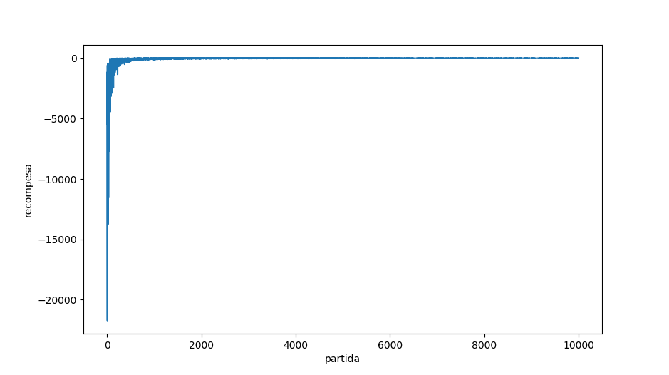
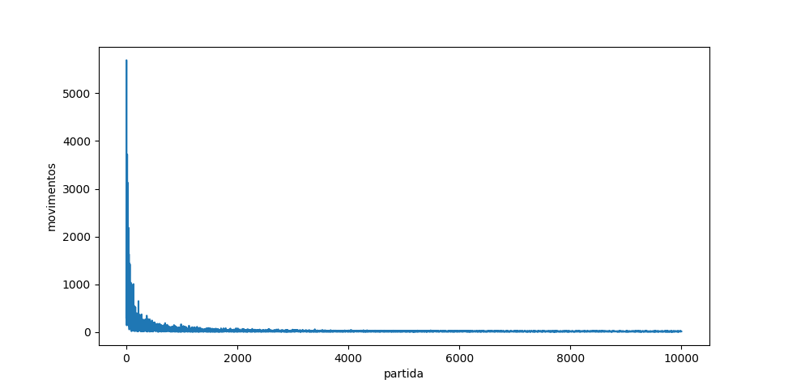
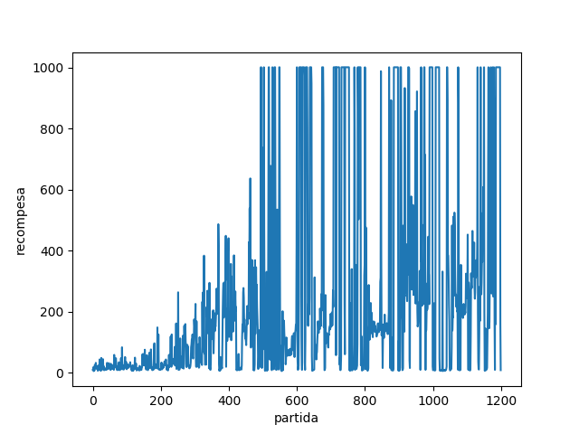
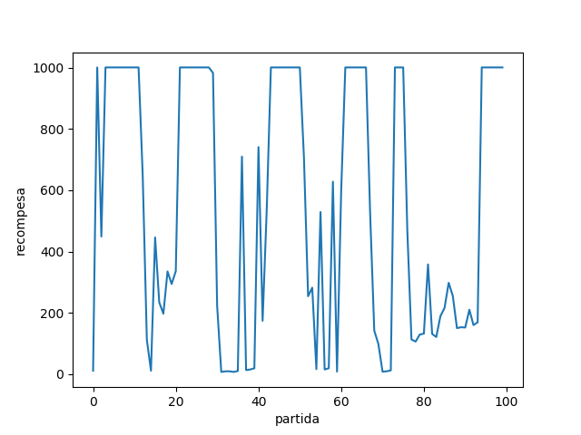

# resolvendo  jogos do openAI

jogos resolvidos:

- [x] Taxi-V2  
- [x] CartPole-V1 
- [ ] FrozenLake-v0

algoritmos de aprendizagem por reforço implementados:
- [x] Q-Learning
- [x] Deep Q-Learning


## Gráficos Taxi-V2
__Gráfico 1:__  recompensa por partida
  


__Gráfico 2:__ total de movimentos do taxi por partida


parâmetros Q-learning    | valor
-------------------------|------
&alpha;                  | 0.2
&gamma;                  | 0.9
&epsilon;                | 1
decaimento do &epsilon;  | 0.9996
&epsilon; min            | 0.01


## Gráficos CartPole-v1
__Gráfico 1:__ recompensa por partida durante o treinamento
  

__Gráfico 2:__ recompensa por partida na fases de testes  
  


A recomenpensa média da Deeo Q-leaning  
para resolver o CartPoleV1 ficou __549.31__


parâmetros ~~mini~~ deep Q-leaning      | valor
-----------------------------------|------
&gamma;                            | 0.99
learning rate                      | 0.001
&epsilon;                          | 1
&epsilon; mínimo                   | 0.01
decaimento do &epsilon;            | 0.996
número de camadas                  | 2
número de nós da primeira camada   | 48
número de nós da segunda camada    | 48
otimizador                         | Adam
funcção objetivo                   | mse

__OBS:__ Como o Cart-Pole respeita o processo de markov  
foi escolhido remover a estrutra _memory_ da Deep Q-leaning  
~~Pelo menos é o que eu acho~~

__dependências desse repositório:__  
numpy  
matplotlib  
keras  
  
para instalar as dependências:
```shell
pip install numpy  
```
```shell
pip install keras  
```
```shell
pip install matplotlib
```